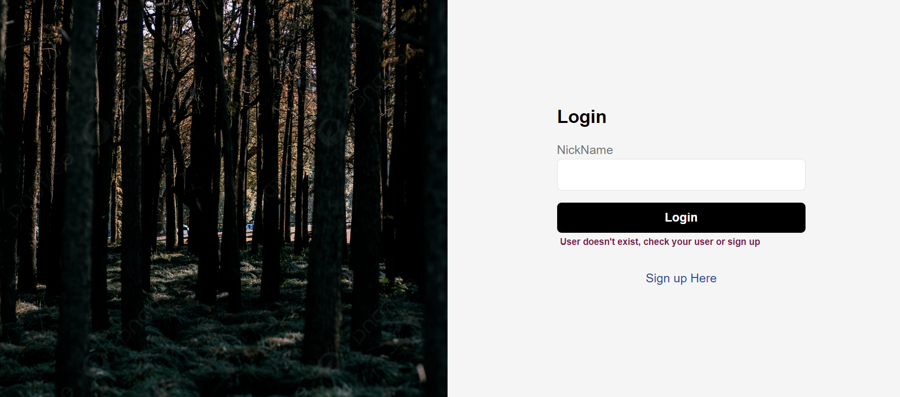
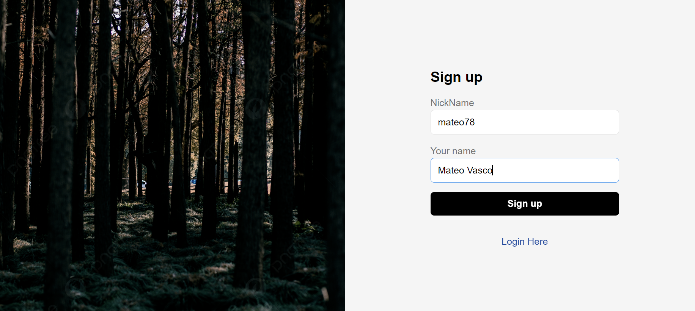
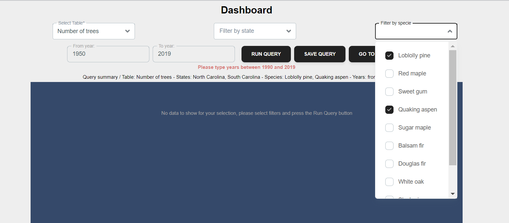
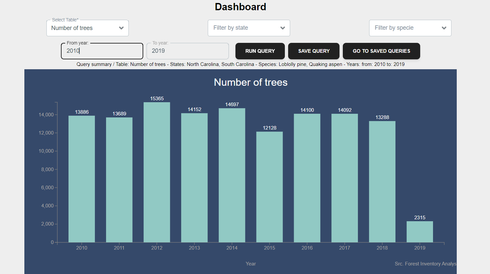
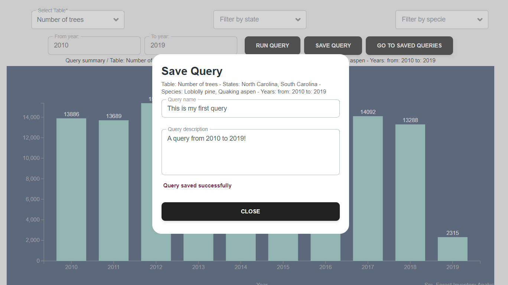
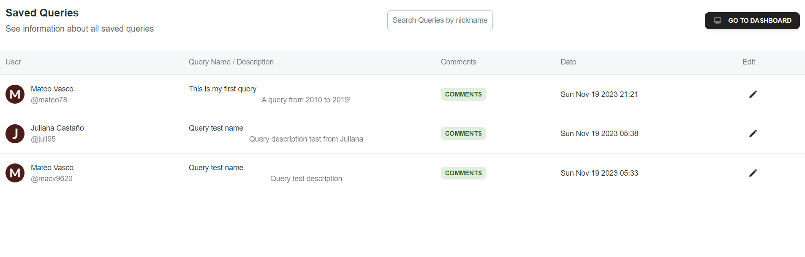
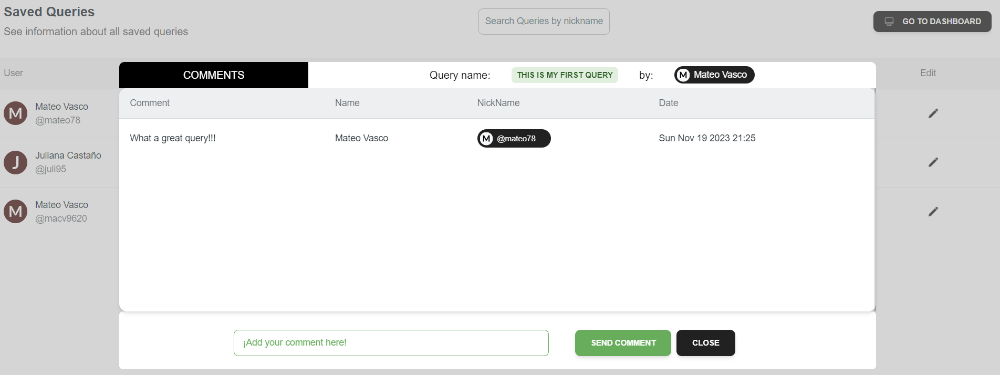
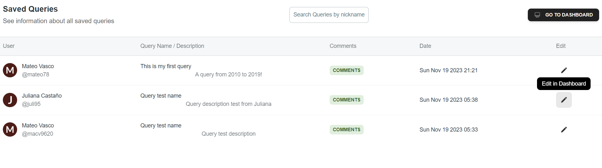

# Forest Inventory Analysis App - Ver+ Tech Fellows

## ¡Use the app!

**The application can be accessed at the following url:**

* [http://vertechawsforestapp.s3-website-us-east-1.amazonaws.com/](http://vertechawsforestapp.s3-website-us-east-1.amazonaws.com/)

## Application Description

This application consults the public tree inventory database [Forest Inventory Analysis - USA](https://console.cloud.google.com/marketplace/product/us-forest-service/forest-inventory-analysis) to bring historical information on the number of trees that were in inventory per year, the application allows filters by year, US states and species of trees.

## For developers

### Deploy and stack

The application was deployed using the following **AWS services**

* **S3** to deploy a React App.
* **EC2** to deploy a Java Spring Boot API.
* **RDS** to deploy a PostgreSQL database.

### Run the application in your local

* Clone, fork or download a repo zip.
* It is a requirement to have docker installed, so make sure you install it and that its engine is running.
* In the root directory, where the `docker-compose.yml` file is, open a terminal and run:

```
docker-compose up
```

* Wait for Docker to launch the application, when this happens you can access it on localhost with port 9000

[localhost:9000](localhost:9000)

### `docker-compose.yml` structure

Watch the following video to learn in detail the structure of `docker-compose.yml`

* [https://www.youtube.com/watch?v=cczS-OdXRIc](https://www.youtube.com/watch?v=cczS-OdXRIc)

## For users

* You can log in to the application with your nickname, if you do not have a created account you can access the sign up form.



* Choose a nickname and type your name, then enter your nickname in the login form.



* Select filters and press "RUN QUERY" to get information



* The graph shows the number of trees in inventory grouped by years and according to the filters you selected.



* You can save queries by pressing the "SAVE QUERY" button



* View all saved queries by pressing the "GO TO SAVED QUERIES" button



* Add and view comments from other users by pressing the "COMMENTS" button



* Were you interested in another user's query? Press the edit button and take it to your dashboard!



* Finally, enjoy the app!
